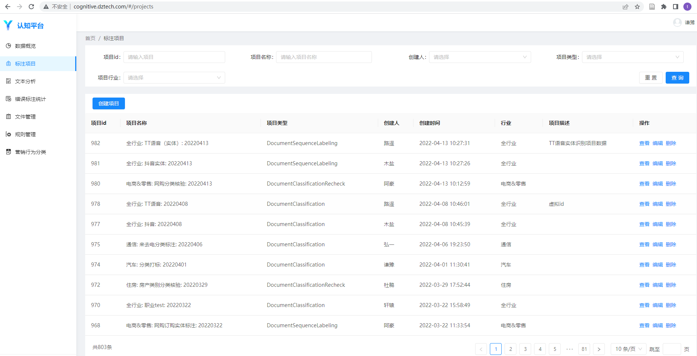

# 结构化工作流程
目的：复现工作结果

## 整体思路
1. 探索从数据源过滤目标数据（汽车短文本）的正则
2. 为目标数据（汽车短文本）人工打标，获取分类模型的训练数据
    - 训练数据可能存在分布不均匀的问题，需要通过主动学习方法，对于数据量少的类别，补充数据
    - 训练数据标注可能存在歧义，需要通过脏数据工具，清洗有歧义的数据
3. 训练分类模型，要求验证集上分类准确率高于95%
4. 

## 开发环境
- 服务器（Linux操作系统）
- hive
- spark

配置脚本：

beeline.sh（hive常用于建表）
```bash
beeline -u "jdbc:hive2://coprocessor01-fcy.hadoop.dztech.com:2181,coprocessor02-fcy.hadoop.dztech.com:2181,coprocessor03-fcy.hadoop.dztech.com:2181/;serviceDiscoveryMode=zooKeeper;zooKeeperNamespace=hiveserver2"
```
rss.sh（sparksql常用于写数）
```bash
#!/bin/bash
. /etc/profile
. ~/.bash_profile

#执行spark-sql
# 参数1：任务名称
# 参数2：执行队列名
# 参数3：执行的sql

if [[ $# != 3 ]];then
    echo "`date '+%Y-%m-%d %H:%M:%S'` | [ERROR] |  run_spark_sql error, error args num"
    exit 1
fi

if [[ "$3" = "" ]];then
    echo "`date '+%Y-%m-%d %H:%M:%S'` | [ERROR] | run_spark_sql error, the sql string can not be empty"
    exit 1
fi


run_spark_l(){
    echo -e "start execute sql:\n$3"
    /usr/local/spark-2.4.3-bin-hadoop2.7/bin/spark-sql --driver-memory 4g \
    --executor-memory 6g \
    --executor-cores 2 \
    --conf spark.yarn.executor.memoryOverhead=4g \
    --conf spark.driver.memoryOverhead=1g \
    --conf spark.sql.autoBroadcastJionThreshold=500485760 \
    --conf spark.network.timeout=800000 \
    --conf spark.driver.maxResultSize=4g \
    --conf spark.rpc.message.maxSize=500 \
    --conf spark.rpc.askTimeout=600 \
    --conf spark.executor.heartbeatInterval=60000 \
    --conf spark.dynamicAllocation.enabled=true \
    --conf spark.shuffle.service.enabled=true \
    --conf spark.dynamicAllocation.minExecutors=5 \
    --conf spark.dynamicAllocation.maxExecutors=200 \
    --conf spark.dynamicAllocation.executorIdleTimeout=100s \
    --conf spark.dynamicAllocation.cachedExecutorIdleTimeout=300s \
    --conf spark.scheduler.mode=FAIR \
    --conf spark.dynamicAllocation.schedulerBacklogTimeout=2s \
    --conf spark.default.parallelism=400 \
    --conf spark.sql.shuffle.partitions=400 \
    --conf spark.sql.broadcastTimeout=1800 \
    --conf spark.maxRemoteBlockSizeFetchToMem=512m \
    --name "$1" \
    --queue "$2" \
    -e "$3"
    if [[  $? == 0 ]];then
        echo -e "`date '+%Y-%m-%d %H:%M:%S'` | [INFO] | spark-sql execute success,sql:\n$3"
        exit 0
    else
        exit 1
    fi
}

run_spark_l  "$1" "$2" "$3"
```

### 关键节点零：数据源
```text
+--------------------------+-----------------------+-------------------------+--+
|         col_name         |       data_type       |         comment         |
+--------------------------+-----------------------+-------------------------+--+
| row_key                  | string                | 行key                    |
| mobile_id                | string                | 被叫                      |
| event_time               | string                | 事件时间                    |
| app_name                 | string                | 明确签名                    |
| suspected_app_name       | string                | 疑似签名                    |
| msg                      | string                | 文本                      |
| main_call_no             | string                | 主叫                      |
| abnormal_label           | string                | 异常标识                    |
| rule_id                  | string                | 命中规则ID                  |
| hashcode                 | string                | simhash标识               |
| the_date                 | string                | YYYY-MM-DD 分区1          |
| file_no                  | string                | xxxx_YYYYMMDD_xxxx 分区2  |
|                          | NULL                  | NULL                    |
| # Partition Information  | NULL                  | NULL                    |
| # col_name               | data_type             | comment                 |
|                          | NULL                  | NULL                    |
| the_date                 | string                | YYYY-MM-DD 分区1          |
| file_no                  | string                | xxxx_YYYYMMDD_xxxx 分区2  |
+--------------------------+-----------------------+-------------------------+--+
```

### 关键节点一：正则
使用1_regexp_exploring文件夹中的代码，生产正则
- 1_limit_sampling: 从数据源抽取10000条数据
- 2_regexp_filter: 检测自定义的正则对数据源的过滤结果，根据结果优化正则

正则逻辑
```text
1、目标数据

签名标签为汽车的数据
msg符合汽车行业规则（关键词或正则）的数据

2、获取逻辑

子规则：

规则1:  abnormal_label 包含 ‘正常文本’

规则2:  app_name 包含’汽车‘
规则3:  app_name 满足正则表达式：'?<[约专快打租单托拖运拼风叫机停泊有用行客货派公中吊卡重叉通出务动力]车$'

规则4:  suspected_app_name 包含'汽车'
规则5:  suspected_app_name 满足正则表达式：'?<[约专快打租单托拖运拼风叫机停泊有用行客货派公中吊卡重叉通出务动力]车$'

规则6:  msg 包含 '车'
规则7:  msg 满足正则表达式： '看车|试驾|试乘|提车|交易车辆|买车|购车|支付.*车款|售车|车抢购|购得爱车|喜得爱车|金融方案'
规则8:  msg 满足正则表达式： '约看(?![牙诊])|带看|询价|(询问|咨询).*价格|咨询.*销售顾问|欲购买|摇号|指标|竞价|竞得|竞拍|上拍|流拍|开拍|拍卖|流拍|报价|出价|成交|撮合邀请|感谢您来到' 
规则9:  msg 不包含’险‘
规则10:  msg 不包含’租‘
规则11：msg不包含‘电’
规则12:  msg 不包含’房‘，‘装修’，‘教育’
规则13:  msg 不包含’乘车‘，’车票‘，’车费‘，‘司机’
规则14:  msg 不包含‘移车’
规则15:  msg 不包含‘ETC’
规则16:  msg 不包含’资讯‘，‘证券’，‘股’，‘基金’，'涨'，'跌'
规则17:  msg不包含'卖'
规则17:  msg 不满足正则表达式：'[约专快打租单托拖运拼风叫机停泊有用行客货派公中吊卡重叉通出务动力]车|货运'
规则18：msg不包含’验证码‘，’登陆凭证‘，’动态密码‘，’激活码‘，’取件码‘
规则19：msg不满足正则表达式：退订|回复*[a-zA-Z]{1,4}[退拒]|拒收回[a-zA-Z]{1,4}|点击|戳|订回[a-zA-Z]{1,4}|低至.折

汇总：
(规则1) and (规则2 or 规则3 or 规则4 or 规则5 or (规则6 and (规则7 or 规则8))) and (规则9 and 规则10 and 规则11 and 规则12 and 规则13 and 规则14 and 规则15 and 规则16 and 规则17 and 规则18 and 规则19)

特别说明：
因为保险项目中包含了车险，所以在规则9中过滤了关键词险
因为汽车营销需求和租赁无关，所以在规则10中过滤关键词租
因为汽车项目和电车无关，所以在规则11中过滤关键词电
为了区分车贷类别和其他用途贷款（装修，教育，房屋），所以在规则12中过滤了关键词房，装修，教育
因为网约车出行项目已完成开发，所以在规则13中过滤了关键词乘车，车票，车费，司机
因为114移车的文本，结构高度相似且规范，可以通过114关键词过滤得到，无需加入分类模型，增加算法助理的打标负担，所以在规则14中不包含移车
因为高速ETC通行项目已完成开发，所以在规则15中过滤了关键词ETC
因为存在汽车衍生的金融产品交易资讯，和汽车营销无关，所以在规则16中过滤了关键词资讯,证券,股,基金
因为对于汽车营销而言，卖车行为是没有价值，所以在规则17中过滤了关键词卖

3、补充进字典中信息

无
```

### 关键节点二：汽车短文本
使用2_template_sampling文件夹中的代码：第一步、抽取数据源的模板数据，第二步，使用正则过滤模板数据，产生汽车短文本
- nearduplicateremoval文件夹中的README可以指导我们安装jar包（模板抽样的代码需要用）
- templatemonitoring文件夹中的模板抽样的代码可生产汽车短文本

1. 安装jar包
```bash
mkdir ~/.ivy2
mv env_pkgs/* ~/.ivy2/
cd ~/.ivy2
tar xvf ~/.ivy2/cache.tgz
tar xvf ~/.ivy2/jars.tgz
```

2. 新建config_sample文件夹（配置文件夹，代码运行需要）

config_sample文件夹结构
```text
.
├── car
│   ├── dict_list_file.json
│   └── domain_extractor.py
```

domain_extractor.py
```python
import re
 
def domain_extractor(msg, app_name, suspected_app_name, hashcode, abnormal_label, dict_list={}):
    """
    参数：msg,app_name,suspected_app_name,hashcode,abnormal_label皆为原始数据表中的字段，dict_list为附加字典表load后的字典对象
    返回值：True（获取该条数据）或者False（不要该条数据）
    """
    rule_out = r'险|租|电|房|装修|教育|乘*车[票费]|司机|移车|ETC|资讯|证券|股|基金|涨|跌|卖|[约专快打租单托拖运拼风叫机停泊有用行客货派公中吊卡重叉通出务动力]车|货运|验证码|登陆凭证|动态密码|激活码|取件码|退订|回复*[a-zA-Z]{1,4}[退拒]|拒收回[a-zA-Z]{1,4}|点击|戳|订回[a-zA-Z]{1,4}|低至.折'
    rule_in_1 = r'车'
    rule_in_2 = r'汽车'
    rule_in_3 = r'(?<![约专快打租单托拖运拼风叫机停泊有用行客货派公中吊卡重叉通出校务动力])车$'
    rule_in_4 = r'看车|试驾|试乘|提车|交易车辆|买车|购车|支付.*车款|售车|车抢购|购得爱车|喜得爱车|金融方案|约看(?![牙诊])|带看|询价|(询问|咨询).*价格|咨询.*销售顾问|欲购买|摇号|指标|竞价|竞得|竞拍|上拍|流拍|开拍|拍卖|流拍|报价|出价|成交|撮合邀请|感谢您来到'
 
    if abnormal_label != '正常文本':
        return False
    # 过滤截断的短文本, 过滤msg的排除规则
    if len(re.sub('[^\u4e00-\u9fa5]','',msg))>15 and not re.search(rule_out,msg):
        if (re.search(rule_in_2,app_name) \
        or re.search(rule_in_3,app_name) \
        or re.search(rule_in_2,suspected_app_name) \
        or re.search(rule_in_3,suspected_app_name) \
        or (re.search(rule_in_1,msg) and re.search(rule_in_4,msg))):
            return True
        else:
            return False
    else:
        return False
```

dict_list_file.json
```
{}
```

3. 运行代码，进行抽数
```bash
# 建表：nlp_dev.car_sample_hash, nlp_dev.car_sample_merge
sh sample_hash/create_sql.sh car_structure car
# 建议用后台命令跑，要跑很久，数据源是preprocess.ds_txt_final_sample
nohup sh sample_hash/start.sh car_structure car 202101 202112 0.01>template_sampling.log 2>&1 &
# 可以动态查看日志
tail -10f template_sampling.log
```

4. 数据去重后随机取数
```sql
drop table if exists nlp_dev.qianyu_20220318_label_more;
create table nlp_dev.qianyu_20220318_label_more like nlp_dev.car_sample_merge;
insert overwrite table nlp_dev.qianyu_20220318_label_more partition(the_month)
select row_key, mobile_id, app_name, suspected_app_name, msg, hashcode, new_hash, cnt, the_month from
(select *, row_number() over (partition by msg order by msg asc) num from nlp_dev.car_sample_merge) t
where t.num = 1;

drop table if exists nlp_dev.qianyu_20220318_label;
create table nlp_dev.qianyu_20220318_label like nlp_dev.qianyu_20220318_label_more;
alter table nlp_dev.qianyu_20220318_label set fileformat textfile;
alter table nlp_dev.qianyu_20220318_label set serdeproperties('serialization.format'='\t', 'field.delim'='\t');
insert overwrite table nlp_dev.qianyu_20220318_label partition(the_month)
select * from nlp_dev.qianyu_20220318_label_more
where rand() <= 0.26
distribute by rand()
sort by rand()
limit 30000;
```

### 关键节点三：分类数据打标
数据打标这块的步骤因公司环境而异
- 条件差，在txt文件中，直接开始人工打标
- 条件好，公司开发一个认知平台（前端+后端），算法工程师上传数据，标签和分类规则，交给算法助理去打标

这里以条件好为例子：
使用3_classification_labeling文件夹中的代码：第一步、认知平台上传数据，交付算法助理打标，第二步，从认知平台下载数据，转化成分类模型训练代码的输入
- parse_data_from_cognitive将认知平台下载的数据转成分类模型训练代码的输入格式

1. 大表拆小表，小表数据不超过5000条
```sql
create table nlp_dev.qianyu_20220318_label_1 like nlp_dev.qianyu_20220318_label;
create table nlp_dev.qianyu_20220318_label_2 like nlp_dev.qianyu_20220318_label;
create table nlp_dev.qianyu_20220318_label_3 like nlp_dev.qianyu_20220318_label;
create table nlp_dev.qianyu_20220318_label_4 like nlp_dev.qianyu_20220318_label;
create table nlp_dev.qianyu_20220318_label_5 like nlp_dev.qianyu_20220318_label;
create table nlp_dev.qianyu_20220318_label_6 like nlp_dev.qianyu_20220318_label;
insert overwrite table nlp_dev.qianyu_20220318_label_1 partition(the_month)
select row_key, mobile_id, app_name, suspected_app_name, msg, hashcode, new_hash, cnt, the_month from
(select *, row_number() over(partition by 1 order by msg desc) AS id from nlp_dev.qianyu_20220318_label) t
where t.id >= 1 and t.id < 5001;
insert overwrite table nlp_dev.qianyu_20220318_label_2 partition(the_month)
select row_key, mobile_id, app_name, suspected_app_name, msg, hashcode, new_hash, cnt, the_month from
(select *, row_number() over(partition by 1 order by msg desc) AS id from nlp_dev.qianyu_20220318_label) t
where t.id >= 5001 and t.id < 10001;
insert overwrite table nlp_dev.qianyu_20220318_label_3 partition(the_month)
select row_key, mobile_id, app_name, suspected_app_name, msg, hashcode, new_hash, cnt, the_month from
(select *, row_number() over(partition by 1 order by msg desc) AS id from nlp_dev.qianyu_20220318_label) t
where t.id >= 10001 and t.id < 15001;
insert overwrite table nlp_dev.qianyu_20220318_label_4 partition(the_month)
select row_key, mobile_id, app_name, suspected_app_name, msg, hashcode, new_hash, cnt, the_month from
(select *, row_number() over(partition by 1 order by msg desc) AS id from nlp_dev.qianyu_20220318_label) t
where t.id >= 15001 and t.id < 20001;
insert overwrite table nlp_dev.qianyu_20220318_label_5 partition(the_month)
select row_key, mobile_id, app_name, suspected_app_name, msg, hashcode, new_hash, cnt, the_month from
(select *, row_number() over(partition by 1 order by msg desc) AS id from nlp_dev.qianyu_20220318_label) t
where t.id >= 20001 and t.id < 25001;
insert overwrite table nlp_dev.qianyu_20220318_label_6 partition(the_month)
select row_key, mobile_id, app_name, suspected_app_name, msg, hashcode, new_hash, cnt, the_month from
(select *, row_number() over(partition by 1 order by msg desc) AS id from nlp_dev.qianyu_20220318_label) t
where t.id >= 25001 and t.id < 30001;
```

2. hive表数据导出到txt文件
```bash
cd /home/nlp_dev/qianyu/label_data
beeline -u "jdbc:hive2://coprocessor01-fcy.hadoop.dztech.com:2181,coprocessor02-fcy.hadoop.dztech.com:2181,coprocessor03-fcy.hadoop.dztech.com:2181/;serviceDiscoveryMode=zooKeeper;zooKeeperNamespace=hiveserver2" --showHeader=false --outputformat=tsv -e "select msg from nlp_dev.qianyu_20220318_label_1">car1.txt
beeline -u "jdbc:hive2://coprocessor01-fcy.hadoop.dztech.com:2181,coprocessor02-fcy.hadoop.dztech.com:2181,coprocessor03-fcy.hadoop.dztech.com:2181/;serviceDiscoveryMode=zooKeeper;zooKeeperNamespace=hiveserver2" --showHeader=false --outputformat=tsv -e "select msg from nlp_dev.qianyu_20220318_label_2">car2.txt
beeline -u "jdbc:hive2://coprocessor01-fcy.hadoop.dztech.com:2181,coprocessor02-fcy.hadoop.dztech.com:2181,coprocessor03-fcy.hadoop.dztech.com:2181/;serviceDiscoveryMode=zooKeeper;zooKeeperNamespace=hiveserver2" --showHeader=false --outputformat=tsv -e "select msg from nlp_dev.qianyu_20220318_label_3">car3.txt
beeline -u "jdbc:hive2://coprocessor01-fcy.hadoop.dztech.com:2181,coprocessor02-fcy.hadoop.dztech.com:2181,coprocessor03-fcy.hadoop.dztech.com:2181/;serviceDiscoveryMode=zooKeeper;zooKeeperNamespace=hiveserver2" --showHeader=false --outputformat=tsv -e "select msg from nlp_dev.qianyu_20220318_label_4">car4.txt
beeline -u "jdbc:hive2://coprocessor01-fcy.hadoop.dztech.com:2181,coprocessor02-fcy.hadoop.dztech.com:2181,coprocessor03-fcy.hadoop.dztech.com:2181/;serviceDiscoveryMode=zooKeeper;zooKeeperNamespace=hiveserver2" --showHeader=false --outputformat=tsv -e "select msg from nlp_dev.qianyu_20220318_label_5">car5.txt
beeline -u "jdbc:hive2://coprocessor01-fcy.hadoop.dztech.com:2181,coprocessor02-fcy.hadoop.dztech.com:2181,coprocessor03-fcy.hadoop.dztech.com:2181/;serviceDiscoveryMode=zooKeeper;zooKeeperNamespace=hiveserver2" --showHeader=false --outputformat=tsv -e "select msg from nlp_dev.qianyu_20220318_label_6">car6.txt
```

3. 调用认知平台API接口上传数据
```bash
curl -H 'Content-Type: multipart/form-data' -F "file=@car1.txt" "http://10.30.103.146:8080/nlp/file/upload/974"
curl -H 'Content-Type: multipart/form-data' -F "file=@car2.txt" "http://10.30.103.146:8080/nlp/file/upload/974"
curl -H 'Content-Type: multipart/form-data' -F "file=@car3.txt" "http://10.30.103.146:8080/nlp/file/upload/974"
curl -H 'Content-Type: multipart/form-data' -F "file=@car4.txt" "http://10.30.103.146:8080/nlp/file/upload/974"
curl -H 'Content-Type: multipart/form-data' -F "file=@car5.txt" "http://10.30.103.146:8080/nlp/file/upload/974"
curl -H 'Content-Type: multipart/form-data' -F "file=@car6.txt" "http://10.30.103.146:8080/nlp/file/upload/974"
```

4. 从认知平台下载训练数据
```bash
curl -X POST -H 'Content-Type:application/json' -d '{"annotation": true, "createdName": "qianyu", "fileType": "txt"}' http://10.30.103.146:8080/nlp/file/download/974
```

5. 使用parse_data_from_cognitive代码，把从认知平台下载训练数据，转化成模型训练的标准格式

```bash
cd ./3_classification_labeling/parse_data_from_cognitive
python3 parse_script.py
```

- 输入前
```
'ttpai.cn/aabyAy9 立即开始上传,预计耗时5分钟,最快当日可获得车辆报价哦!关注公众号,可实时查看检测进度及报价哦。'\x01其它\x01null\x01null\x01
```

- 输入后
```text
'ttpai.cn/aabyAy9 立即开始上传,预计耗时5分钟,最快当日可获得车辆报价哦!关注公众号,可实时查看检测进度及报价哦。'	其它
```

5. 评估训练数据的质量

如果数据质量不合格（分布不均衡），则需要调整
- 某个分类数据量过少：
    - 方法一、自己写正则从数据源去挖
    - 方法二、训练一个粗糙的分类模型，去预测数据源的数据，专门抽取数据量少的分类，生成新的打标数据，交付算法助理去打标
- 某个分类数据量过多：
    - 随机抽样

| 标签 | 数据量 | 调整方案 |
| ---- | ---- | ---- |
| 购车意向_看车询价 | 406 | 406 |
| 购车意向_买车 | 735 | 735 |
| 购车意向_摇号竞价 | 66 | 增加到500 |
| 购车意向_学车考试 | 91 | 增加到500 |
| 购车意向_车牌号预选 | 23 | 增加到500 |
| 有车行为_车贷 | 8336 | 减少到500 |
| 有车行为_记分办证 | 164 | 增加到500 |
| 有车行为_备案 | 0 | 删除该分类标签 |
| 有车行为_车检年审 | 55 | 增加到500 |
| 有车行为_洗车 | 466 | 466 |
| 有车行为_保养维修 | 3682 | 减少到500 |
| 有车行为_加油充值 | 2 | 删除该分类标签 |
| 有车行为_车辆告警 | 1505 | 减少到500 |
| 非汽车 | 2157 |  |
| 其他 | 12312 |  |


[认知平台接口文档](http://cognitive.dztech.com/doc.html)



### 关键节点四：分类模型训练

使用4_classifier_training中的代码
- classifiergeneral代码支持分类模型的训练，预测，脏数据处理等功能

1. 分类代码运行需要配置文件
```bash
cd classifiergeneral/config
vim label.json
```

写入分类的类别
```text
[
    "购车意向_看车询价",
    "购车意向_买车",
    "购车意向_摇号竞价",
    "购车意向_学车考试",
    "购车意向_车牌号预选",
    "有车行为_车贷",
    "有车行为_记分办证",
    "有车行为_年检年审",
    "有车行为_洗车",
    "有车行为_保养维修",
    "有车行为_车辆告警",
    "非汽车",   
    "其它"
]
```

2. 运行代码，训练模型（代码的运行环境需要切换到nlp用户，因为python代码的运行环境是nlp用户部署的）
```bash
chown -R nlp classifiergeneral
su nlp
CUDA_VISIBLE_DEVICES=0 python3 train.py --train_dataset_path /home/nlp/qianyu/label_data/new_car.txt --model_name DPCNN
```

3. 结果核验（重新找一批汽车短文本，使用模型预测，对预测结果进行人工核验)
```bash
CUDA_VISIBLE_DEVICES=0,1 OMP_NUM_THREADS=1 python -m torch.distributed.launch --nproc_per_node=2 multiple_predict.py --model_fold ./checkpoint/DPCNN --read_path * --write_path * --msg_index * --half
```

